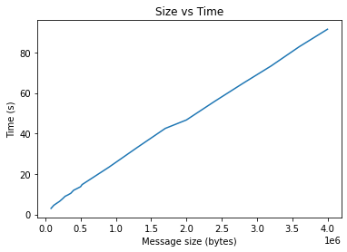
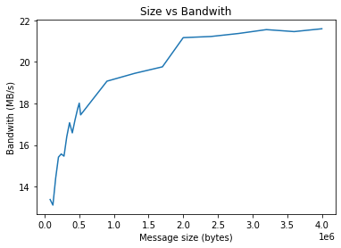
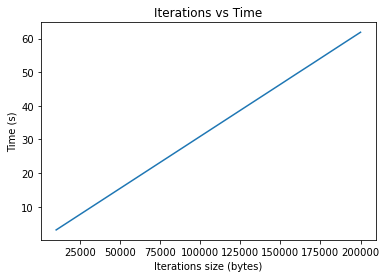

# Results

First, I studied what happens as the size of the message increases. The results are presented in the following table and compactly in [`Test_its`](Test_size.txt).

| Size (bytes) | Iterations | Total time (s) | Time per message | Bandwidth (MB/s) |
|--------------|------------|----------------|------------------|------------------|
| 80000        | 100000     | 2.955158e+00   | 33839.14         | 1.337515e+01     |
| 120000       | 100000     | 4.523913e+00   | 22104.76         | 1.310559e+01     |
| 160000       | 100000     | 5.485601e+00   | 18229.54         | 1.441071e+01     |
| 200000       | 100000     | 6.409724e+00   | 15601.29         | 1.541630e+01     |
| 240000       | 100000     | 7.615918e+00   | 13130.39         | 1.556964e+01     |
| 280000       | 100000     | 8.946412e+00   | 11177.66         | 1.546317e+01     |
| 320000       | 100000     | 9.638150e+00   | 10375.44         | 1.640385e+01     |
| 360000       | 100000     | 1.041659e+01   | 9600.07          | 1.707522e+01     |
| 400000       | 100000     | 1.191604e+01   | 8392.05          | 1.658508e+01     |
| 440000       | 100000     | 1.262185e+01   | 7922.77          | 1.722341e+01     |
| 480000       | 100000     | 1.333210e+01   | 7500.69          | 1.778821e+01     |
| 500000       | 100000     | 1.371103e+01   | 7293.40          | 1.801728e+01     |
| 520000       | 100000     | 1.472067e+01   | 6793.17          | 1.745280e+01     |
| 900000       | 100000     | 2.331077e+01   | 4289.86          | 1.907548e+01     |
| 1300000      | 100000     | 3.301736e+01   | 3028.71          | 1.945318e+01     |
| 1700000      | 100000     | 4.249212e+01   | 2353.38          | 1.976651e+01     |
| 2000000      | 100000     | 4.667209e+01   | 2142.61          | 2.117202e+01     |
| 2400000      | 100000     | 5.585905e+01   | 1790.22          | 2.122791e+01     |
| 2800000      | 100000     | 6.472637e+01   | 1544.97          | 2.137304e+01     |
| 3200000      | 100000     | 7.333496e+01   | 1363.61          | 2.155899e+01     |
| 3600000      | 100000     | 8.286990e+01   | 1206.71          | 2.146323e+01     |
| 4000000      | 100000     | 9.149536e+01   | 1092.95          | 2.159983e+01     |

Two plots are included. First, there is a graph of time against message size to determine the latency.

Using a Least squares polynomial fit of degree 12, this is the first value for which the sum of squared residuals of the fit is around 0.5, we get that the latency is around 0.89 (MB/s).

Second, there is a plot of bandwidth against size, where we can see that the asymptotic bandwidth for large messages is around 22 (MB/s).

Afterwards, I studied what happens as the number of iterations increases while leaving the size of the message static. The results are presented in the following table and compactly in [`Test_its`](Test_its.txt).

| Size (bytes) | Iterations | Total time (s) | Time per message | Bandwidth (MB/s) |
|--------------|------------|----------------|------------------|------------------|
| 1200000      | 10000      | 3.096715e+00   | 3229.23          | 1.914562e+02     |
| 1200000      | 20000      | 6.191477e+00   | 3230.25          | 9.575831e+01     |
| 1200000      | 30000      | 9.287227e+00   | 3230.24          | 6.383879e+01     |
| 1200000      | 40000      | 1.238136e+01   | 3230.66          | 4.788532e+01     |
| 1200000      | 50000      | 1.547858e+01   | 3230.27          | 3.830359e+01     |
| 1200000      | 60000      | 1.857319e+01   | 3230.46          | 3.192158e+01     |
| 1200000      | 70000      | 2.167082e+01   | 3230.15          | 2.735869e+01     |
| 1200000      | 80000      | 2.476397e+01   | 3230.50          | 2.394145e+01     |
| 1200000      | 90000      | 2.785614e+01   | 3230.89          | 2.128383e+01     |
| 1200000      | 100000     | 3.095497e+01   | 3230.50          | 1.915315e+01     |
| 1200000      | 110000     | 3.404762e+01   | 3230.77          | 1.741342e+01     |
| 1200000      | 120000     | 3.714366e+01   | 3230.70          | 1.596195e+01     |
| 1200000      | 130000     | 4.023982e+01   | 3230.63          | 1.473380e+01     |
| 1200000      | 140000     | 4.332915e+01   | 3231.08          | 1.368329e+01     |
| 1200000      | 150000     | 4.642122e+01   | 3231.28          | 1.277186e+01     |
| 1200000      | 160000     | 4.952980e+01   | 3230.38          | 1.197028e+01     |
| 1200000      | 170000     | 5.260970e+01   | 3231.34          | 1.126951e+01     |
| 1200000      | 180000     | 5.571722e+01   | 3230.60          | 1.064097e+01     |
| 1200000      | 190000     | 5.881913e+01   | 3230.24          | 1.007980e+01     |
| 1200000      | 200000     | 6.190673e+01   | 3230.67          | 9.577075e+00     |

We observe that as the number of iterations increases, the bandwidth decreases. It asymptotically has a value of around 9 (MB/s).

In this case, a linear interpolation presents a latency of around 16 (MB/s), yet this has an issue of poor conditioning.

